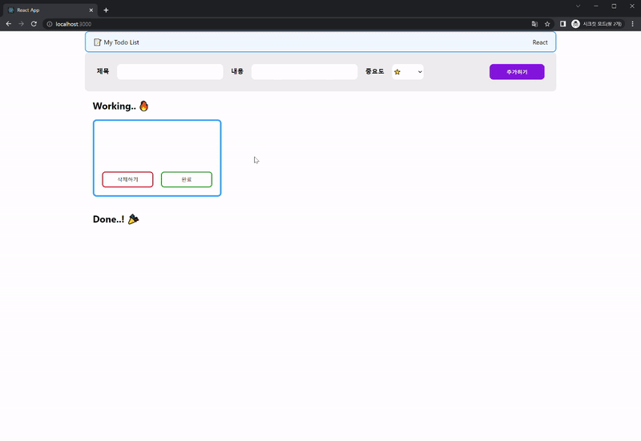

# Todo List

항해99 Chapter 3 React 주특기 기초

<!--  -->

<div>


</div>

<br>

> ***간단한 투두리스트 프로젝트***

<br>

### 프로젝트 기간
2022.07.22 ~ 2022.07.27

<br>

## 실행 방법

패키지 설치
```
npm install
```

실행
```bash
yarn start
```

<br>

## 기능 구현

<div align="center">

</div>
<br>

1. 제목, 내용, 중요도를 선택해 투두리스트에 추가한다.
2. 투두리스트를 완료하면 완료 버튼을 누른다.
3. 투두리스트가 취소되면 취소 버튼을 누른다.
4. 투두리스트를 삭제한다.

<br>

## 구조
```
├── public
├── src
│	├── components
|	│	├── form
|	|	│	├── From.jsx
|	|	│	└── style.css
|	│	├── header
|	|	│	├── Header.jsx
|	|	│	└── style.css
|	│	├── layout
|	|	│	├── Layout.jsx
|	|	│	└── style.css
|	│	├── list
|	|	│	├── List.jsx
|	|	│	└── style.css
|	│	└── todo
|	|	├── Todo.jsx
|	|	└── style.css
│	└── pages
|	|		└── TodoList.jsx
|	├── App.css
|	├── App.js
|	├── App.test.js
|	├── index.css
|	├── index.js
|	├── logo.svg
│	├── reportWebVitals.js
│	└── setipTests.js
├── .gitignore
├── package.json
├── yarn.lock
└── README.md
```
<br>
