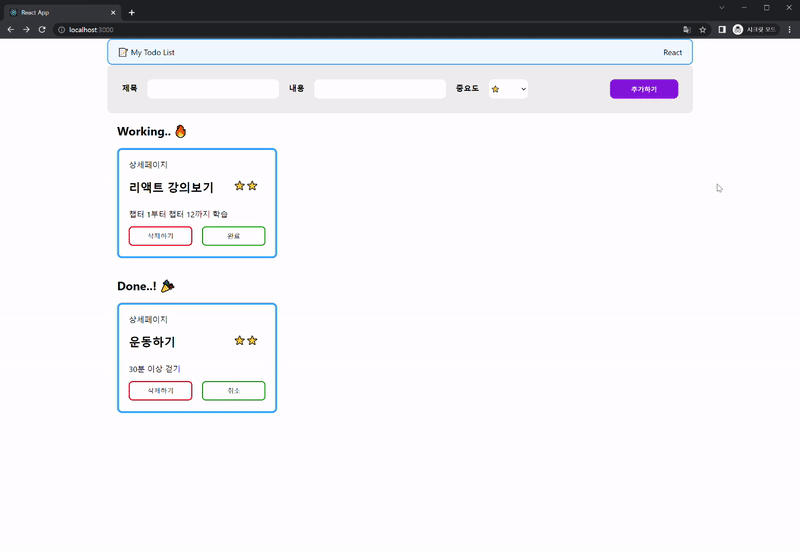
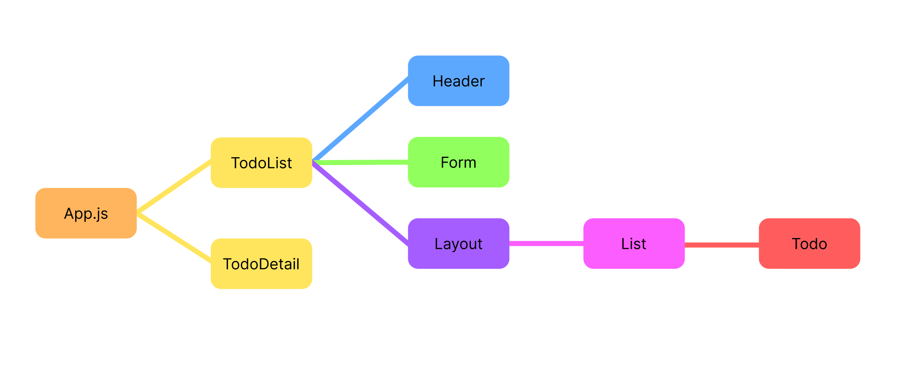

# Todo List

항해99 Chapter 3 React 주특기 기초

<!--  -->

<div>


</div>

<br>

> ***간단한 투두리스트 만들기***

<br>

### 프로젝트 기간
2022.07.22 ~ 2022.08.03

<br>

## 실행 방법

패키지 설치
```
npm install
```

실행
```bash
yarn start
```

<br>

## 기능 구현

<div align="center">

</div>
<br>

1. 제목, 내용, 중요도를 선택해 투두리스트에 추가한다.
2. 투두리스트를 완료하면 "완료" 버튼을 누른다.
3. 투두리스트가 취소되면 "취소" 버튼을 누른다.
4. 투두리스트를 삭제한다.
5. 투두리스트의 "상세페이지"를 클릭하면 상세화면으로 이동한다.
6. 상세화면에서 "이전으로" 버튼을 누르면 이전 화면으로 이동한다.

<br>

## 컴포넌트 구조
<div align="center">

</div>
<br>

|Name|Component/Page|Explain|
|---|---|------|
|Header|Component|가장 상단 데이터를 보여주는 컴포넌트|
|Form|Component|제목, 내용, 중요도 입력하고, 데이터를 추가하는 컴포넌트|
|Todo|Component|투두리스트 1개의 컴포넌트|
|List|Component|투두리스트 여러개가 모여서 하나의 Working 혹은 Done을 구성하는 컴포넌트|
|Layout|Component|Working, Done을 모두 합친 컴포넌트(모든 투두리스트)|
|TodoList|Page|투두리스트 전체를 보여주는 페이지(Header, Form, Layout)|
|TodoDetail|Page|상세 화면을 보여주는 페이지|
<br>

### 컴포넌트 구조 설명
Layout Component에 모든 투두리스트를 보여주도록 구현하였다.<br>
Layout Component 안에 투두리스트의 상태에 따라 Working list, Done list로 구성하여 각각 List Component로 전달하였다.<br>
List Component는 여러 개의 투두리스트들이 모인 컴포넌트이다.<br>
투두리스트 1개를 Todo Component로 구현하였다.<br>
따라서 List Component는 Todo Component를 호출하여 여러 개의 투두리스트로 구현하였다.


<br>

## 구조
```
├── public
├── src
│   ├── components
|   │   ├── form
|   |   │   ├── From.jsx
|   |   │   └── style.css
|   │   ├── header
|   |   │   ├── Header.jsx
|   |   │   └── style.css
|   │   ├── layout
|   |   │   ├── Layout.jsx
|   |   │   └── style.css
|   │   ├── list
|   |   │   ├── List.jsx
|   |   │   └── style.css
|   │   └── todo
|   |      ├── Todo.jsx
|   |      └── style.css
│   └── pages
|   |   ├── TodoDetail.jsx
|   |   └── TodoList.jsx
│   └── redux
|   |   ├── config
|   |   |   └── configStore.js
|   |   └── modules
|   |       ├── todos.js
|   |       └── todosToolkit.js
│   └── shard
|   |   └── Router.js
|   ├── App.css
|   ├── App.js
|   ├── App.test.js
|   ├── index.css
|   ├── index.js
|   ├── logo.svg
│   ├── reportWebVitals.js
│   └── setipTests.js
├── .gitignore
├── package.json
├── yarn.lock
└── README.md
```
<br>
